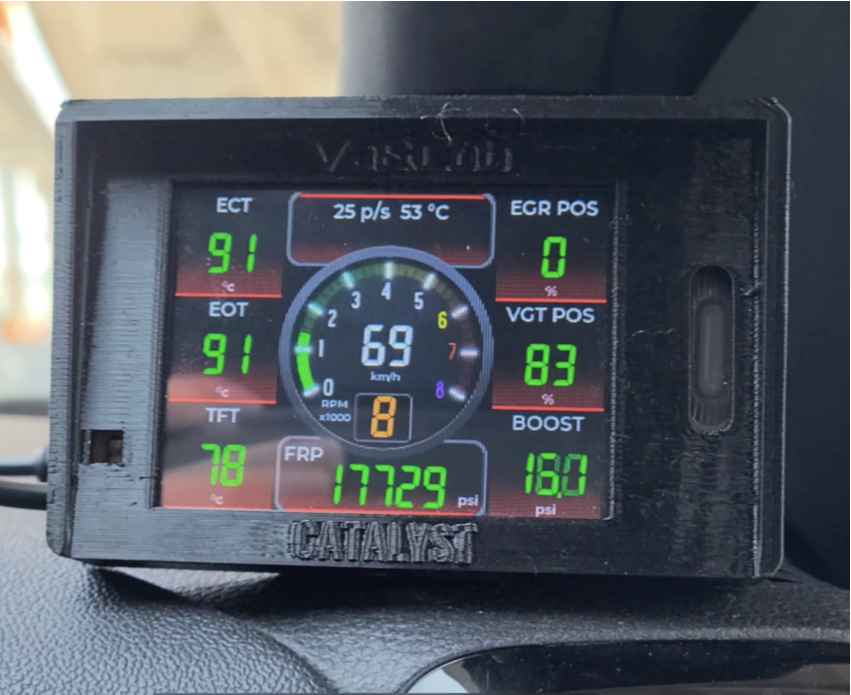
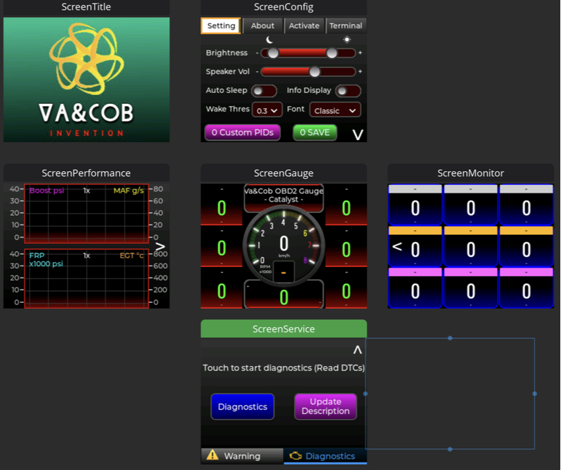

# OBD2 Gauge Catalyst (ESP32 + ELM327 Serial)

Real-time automotive gauge dashboard for **ESP32-2432S028R (CYD 2.8")** using **ELM327 over Serial UART**.

This project is inspired by the Bluetooth version here:  
[VaAndCob/ESP32-Blutooth-OBD2-Gauge](https://github.com/VaAndCob/ESP32-Blutooth-OBD2-Gauge)  
but this version is a different codebase focused on:
- Serial ELM327 communication (not Bluetooth)
- improved responsiveness and stability
- expanded UI/config and diagnostics workflow




## Highlights

- Live OBD2 data on touch UI (LVGL + LovyanGFX)
- Multiple pages:
  - Gauge
  - Monitor
  - Performance charts
  - Config
  - Service/Diagnostics (DTC)
- Configurable/custom PID list from `pid_custom.csv`
- DTC read/clear and DTC description file update from SD card
- Auto-dimming brightness (LDR)
- CPU temperature monitoring and warning
- Optional MPU6050 support
- Audio feedback (beep/click)

## Hardware

- ESP32 CYD 2.8" (`ESP32-2432S028R`, ILI9341 + XPT2046 touch)
- ELM327 adapter (Serial UART type)
- OBD2 cable/adapter and vehicle OBD2 port
- Optional: SD card, MPU6050, LDR for auto-dim

## How to modify ELM327 adaptor & Parts List (Affiliate Links)

[`document/parts/README.md`](document/parts/README.md)

## 3D Printed Enclosure

3D enclosure files are included in [`document/enclosure/`](document/enclosure):

## Software Stack

- PlatformIO (Arduino framework)
- ESP32 platform: `espressif32@^6.12.0`
- Libraries:
  - `lovyan03/LovyanGFX@^1.2.7`
  - `lvgl/lvgl@^8.3.11`
  - `electroniccats/MPU6050@^1.4.4`

See project config: [`sketch/platformio.ini`](sketch/platformio.ini)

## Project Structure

```text
sketch/
  src/
    main.cpp           # main loop, ELM init/read loop, LVGL handling
    elm327.cpp/.h      # PID parsing, formulas, DTC/VIN logic
    accessory.cpp/.h   # filesystem, settings, audio, sensors, helpers
    ui/                # generated LVGL UI files + event bindings
  include/
    pid_define.h       # default PID table
    LGFX_CYD.h         # display/touch config for CYD
  data/
    dtc.txt
    pid_custom.csv
  platformio.ini
```

## Build and Flash

1. Install [PlatformIO](https://platformio.org/install).
2. Open this repository in VS Code with PlatformIO extension.
3. Build and upload firmware:
   - `Upload` in PlatformIO
4. Upload filesystem image (`sketch/data`) to LittleFS:
   - `Upload Filesystem Image`
5. Open serial monitor at `115200`.

## Runtime Notes

- ELM327 is initialized with AT command sequence at boot.
- If custom PID file exists in LittleFS (`/pid_custom.csv`), it overrides defaults.
- DTC description file can be updated from SD card (`/dtc.txt`).
- UI supports brightness, volume, font, info toggles, auto power-off, and activation flow.

## Difference From Bluetooth Version

- Uses **direct Serial UART to ELM327** instead of Bluetooth SPP transport.
- Refactored communication/parse loop for faster data refresh.
- Updated UI/event flow and configuration behavior.
- Different source layout and implementation details.

## Status

Active development project.  
Contributions and issue reports are welcome.
editedit

