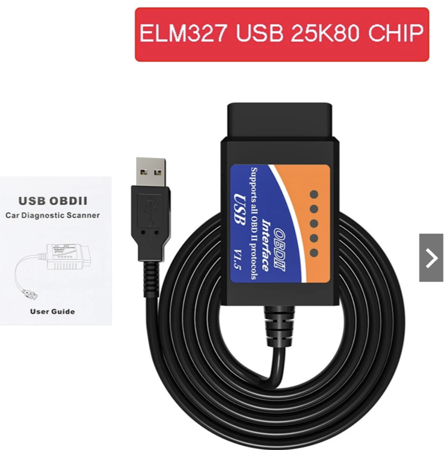
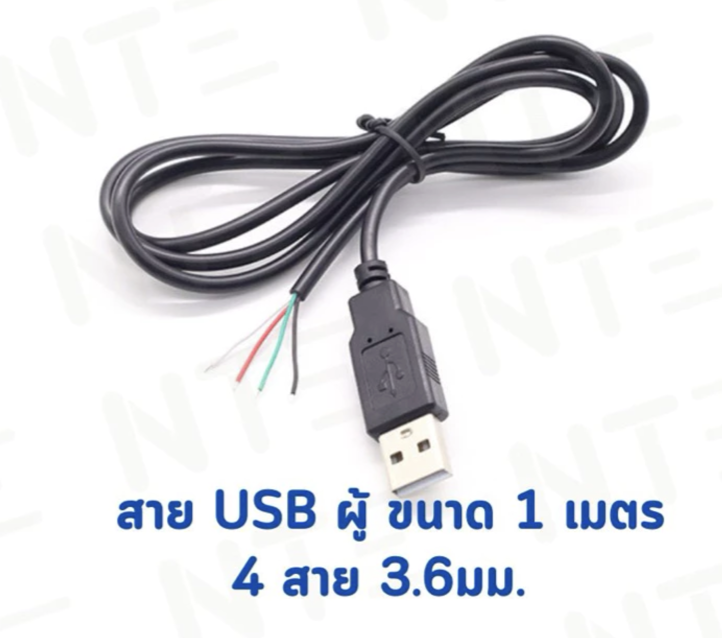
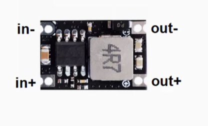
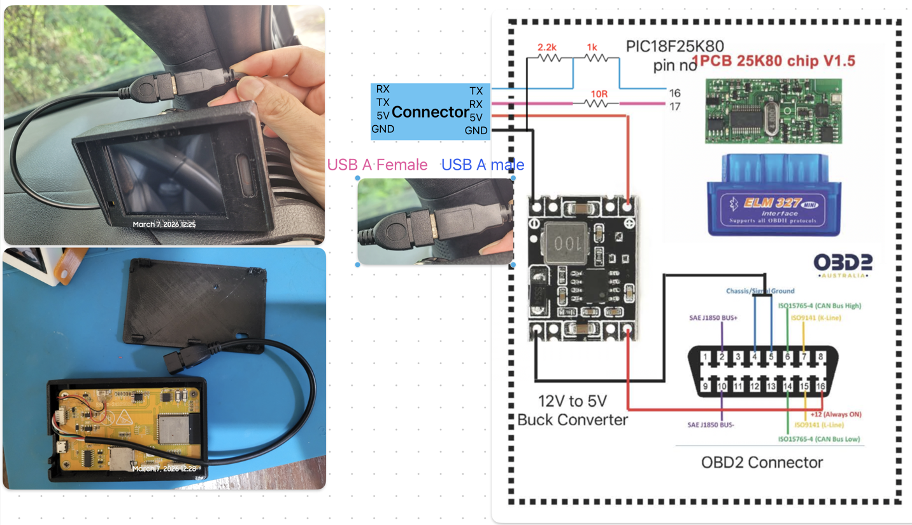

# Parts List (Affiliate Links)

## Main Components

1. ESP32 CYD 2.8"   
https://s.click.aliexpress.com/e/_c3Vjrw67

2. ELM327 USB PIC18F25K80 adaptor 
 https://s.shopee.co.th/4Av1LXhzkG

   

3. MX1.25 4Pin to USB Power Cable Type-A   
https://s.shopee.co.th/900H6O0D7R  
https://s.click.aliexpress.com/e/_c2yYfwfd

4. USB A male cable 1 meter   
https://s.shopee.co.th/2VmnMNiEsa

5. DC to DC power supply 5V 3A   
https://s.shopee.co.th/9fFxtgI7mK

## Connection diagram      

1. Remove serial-to-USB bridge chip.
2. connect voltage divider resistor as the diagram in connection.png
3. install 12V to 5V 3Amp buck converter
4. install USB A male cable out from elm327 adaptor
 
ESP32 CYD 2.8" just connect the USB A Female - JST1.25 4PIN to the serial connector on the board.
